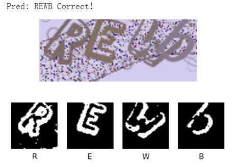

# ElectiveCaptcha



基于opencv与tensorflow的验证码自动识别，单字符准确率约98%，完全准确率约95%，主要提供了最终的预处理部分思路，模型```./resnet_model2.hs```。

Baseline模型和上下游相关工具采用 [MIT License](https://mit-license.org/) 进行许可。

本项目仅用于学习交流，数据集见[xmcp/elective-dataset-2021spring](https://github.com/xmcp/elective-dataset-2021spring)，只使用了约1/4。

[PKUAutoElevtive](https://github.com/zhongxinghong/PKUAutoElective)重写了此处的图像预处理代码，使得其摆脱OpenCV依赖库。由于该项目采用pytorch，因此模型的训练与本项目是独立的，准确率相近，而PKUAutoElevtive的模型经过了更加细致的Fine Tunning.

数据集大小：共5130张gif(按8:2划分训练集与测试集)，AutoElective的训练集会更大。

## Requirements

* tensorflow 2.1.0
* opencv
* pillow
* numpy
* matplotlib (optional)
* tqdm (optional)

## 文件结构
### preprocess_v3.py

数据预处理，以下是核心算法：

GIF共16帧，后3个字母可以通过4, 8, 12, 16作差得到；第一个字母需要经过去噪。

对于第一个字符，以及另外三个作差得到的图，首先通过Otsu进行全局直方图二值化。

如果是作差得到的，噪音较小，可以形态学开运算+中值滤波降噪，效果极佳；如果是第一个字符的图片，用两个很小的结构元(1x2与2x1)分别作形态学闭运算，并分别中值滤波，然后比对图片靠左部分的平均灰度，选择更黑（保留字符信息最多）的那个作为输出。

同时还需进行裁剪，由于只需确定大致范围，可以通过激进的中值滤波+形态学腐蚀，把字符部分弄成一坨黑的，然后用宽为30的滑窗选择最黑的位置。遇到过前一个字符变色导致后一个图片出现两个字符的情况，因此还要对二值化的图片进行逻辑运算去除前一张图中已存在的字符。

最后，把得到的白底黑字图反相为黑底白字。

### split_data.py
将得到的数据集分为训练集与测试集，目前的比例是8:2

### class_string.py
并不是所有字符都会出现在验证码中，数字019字母IJOZ这7个字符不会出现

### model.py
一个普通的resnet，未经fine tuning，参数随缘设置

### train.py
训练代码，以下是我的训练日志，所有参数未经Fine tuning：

```
Epoch 1/15
513/513 [==============================] - 60s 118ms/step - loss: 2.1244 - accuracy: 0.4911 - val_loss: 1.8621 - val_accuracy: 0.4995
Epoch 2/15
513/513 [==============================] - 51s 100ms/step - loss: 0.8455 - accuracy: 0.8518 - val_loss: 0.7356 - val_accuracy: 0.8700
Epoch 3/15
513/513 [==============================] - 52s 101ms/step - loss: 0.5946 - accuracy: 0.9208 - val_loss: 0.5254 - val_accuracy: 0.9374
Epoch 4/15
513/513 [==============================] - 52s 101ms/step - loss: 0.5114 - accuracy: 0.9425 - val_loss: 0.5804 - val_accuracy: 0.9208
Epoch 5/15
513/513 [==============================] - 52s 101ms/step - loss: 0.4653 - accuracy: 0.9534 - val_loss: 0.4661 - val_accuracy: 0.9435
Epoch 6/15
513/513 [==============================] - 52s 101ms/step - loss: 0.4405 - accuracy: 0.9540 - val_loss: 0.4159 - val_accuracy: 0.9582
Epoch 7/15
513/513 [==============================] - 52s 101ms/step - loss: 0.4094 - accuracy: 0.9613 - val_loss: 0.4687 - val_accuracy: 0.9377
Epoch 8/15
513/513 [==============================] - 52s 101ms/step - loss: 0.3894 - accuracy: 0.9641 - val_loss: 0.4070 - val_accuracy: 0.9570
Epoch 9/15
513/513 [==============================] - 52s 101ms/step - loss: 0.3730 - accuracy: 0.9657 - val_loss: 0.3574 - val_accuracy: 0.9726
Epoch 10/15
513/513 [==============================] - 52s 101ms/step - loss: 0.3599 - accuracy: 0.9675 - val_loss: 0.3486 - val_accuracy: 0.9731
Epoch 11/15
513/513 [==============================] - 52s 101ms/step - loss: 0.3402 - accuracy: 0.9719 - val_loss: 0.3388 - val_accuracy: 0.9736
Epoch 12/15
513/513 [==============================] - 52s 101ms/step - loss: 0.3368 - accuracy: 0.9708 - val_loss: 0.3095 - val_accuracy: 0.9780
Epoch 13/15
513/513 [==============================] - 52s 101ms/step - loss: 0.3210 - accuracy: 0.9727 - val_loss: 0.3035 - val_accuracy: 0.9802
Epoch 14/15
513/513 [==============================] - 52s 101ms/step - loss: 0.3028 - accuracy: 0.9772 - val_loss: 0.2983 - val_accuracy: 0.9756
Epoch 15/15
513/513 [==============================] - 52s 101ms/step - loss: 0.3038 - accuracy: 0.9734 - val_loss: 0.2868 - val_accuracy: 0.9797
```

### predict.py
测试一张图，输入gif,输出识别结果

### bootstrap.py
自举，登录选课网获取识别验证码并提交，测试准确率（约95%）

### bootstrap-visualize.ipynb
验证码识别过程可视化。


## 相关工作

- [zhongxinghong/PKUElectiveCaptcha2021Spring](https://github.com/zhongxinghong/PKUElectiveCaptcha2021Spring)
- [xmcp/elective-dataset-2021spring](https://github.com/xmcp/elective-dataset-2021spring)

by *Elector Quartet* (按字典序的倒序 *@xmcp, **@SpiritedAwayCN**, @Rabbit, @gzz*)